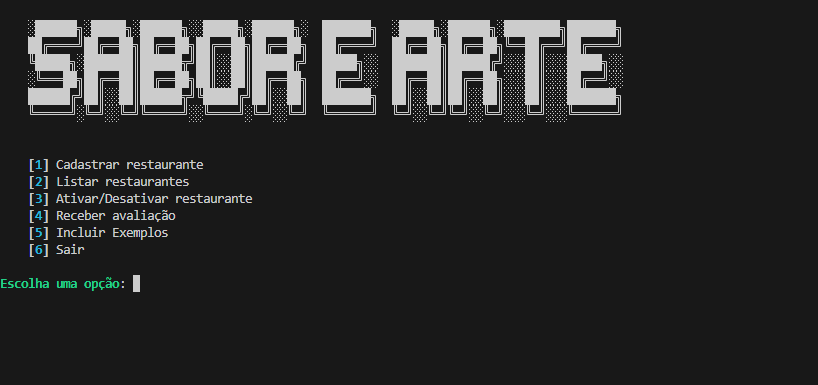
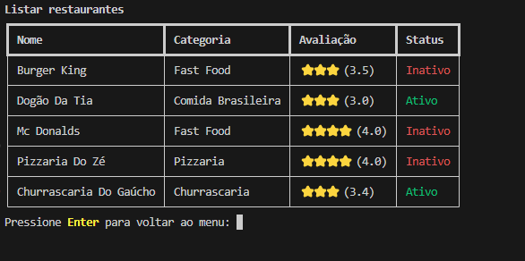

# 🍴 Sistema de Gerenciamento de Restaurantes

Um sistema simples e interativo para gerenciar restaurantes, desenvolvido em Python com o pacote [Rich](https://rich.readthedocs.io/en/stable/) para estilização de console.

---

## 📚 Sobre o Projeto

Este projeto foi desenvolvido durante dois cursos de Python realizados na plataforma [Alura](https://www.alura.com.br). Mesmo sem ser solicitado, realizei a junção dos dois projetos apresentados nos cursos, incorporando melhorias e novas funcionalidades para torná-lo mais robusto e funcional.

---

## 📋 Funcionalidades

- ✅ **Cadastrar Restaurantes:** Adicione novos restaurantes com nome e categoria.
- 📋 **Listar Restaurantes:** Exiba todos os restaurantes cadastrados em uma tabela estilizada.
- 🔄 **Ativar/Desativar Restaurantes:** Altere o status de um restaurante (ativo/inativo).
- ⭐ **Receber Avaliações:** Registre avaliações feitas por clientes e calcule a média automaticamente.
- ➕ **Incluir Exemplos:** Adicione exemplos pré-definidos de restaurantes com avaliações.
- ❌ **Encerrar Programa:** Finalize a execução do sistema de forma segura.

---

## 🛠️ Como Usar
1. **Instale as dependências**:
   Certifique-se de ter o Python instalado e, em seguida, instale o Rich:
   ```bash
   pip install rich
   ```

2. **Execute o programa**:
   ```bash
   python app.py
   ```

---

## 📂 Estrutura do Projeto

```plaintext
.
├── app.py              # Arquivo principal que executa o sistema
├── modelos/
│   ├── avalaicao.py     # Classe Avaliação
│   └── restaurante.py   # Classe Restaurante
├── README.md            # Documentação do projeto
```

---

## 🖥️ Demonstração





---

## 📝 Funcionalidades Explicadas

### Cadastrar Restaurante ➕
Permite adicionar novos restaurantes, selecionando uma categoria a partir de uma lista de opções predefinidas.

### Listar Restaurantes 📋
Exibe todos os restaurantes cadastrados com informações de:
- Nome
- Categoria
- Avaliação média (exibida como estrelas ⭐)
- Status (Ativo ou Inativo)

### Ativar/Desativar Restaurante 🔄
Ativa ou desativa o status de um restaurante, permitindo o controle do funcionamento.

### Receber Avaliação ⭐
Adiciona uma avaliação de um cliente a um restaurante, atualizando automaticamente a média de avaliações.

### Incluir Exemplos ➕
Adiciona uma lista de restaurantes de exemplo com avaliações para facilitar os testes.

---

## 🚀 Tecnologias Utilizadas

- **Python** 🐍
- **Rich** 🎨 para estilização de console
- **Estruturas de dados** para gerenciamento eficiente dos restaurantes e avaliações

---

## ✨ Melhorias Realizadas

- Integração dos projetos dos dois cursos em um único sistema completo e funcional.
- Implementação de tabelas estilizadas e melhor organização da saída no console utilizando o pacote `Rich`.
- Adição de funcionalidades como **incluir exemplos** para facilitar a experiência do usuário.

---


.\venv\Scripts\activate.bat

uvicorn main:app --reload

http://127.0.0.1:8000/docs

pip freeze > requirements.txt
